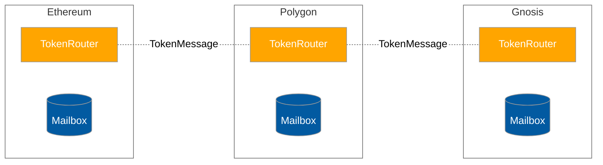
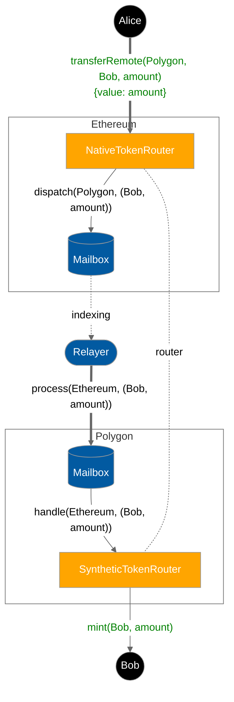
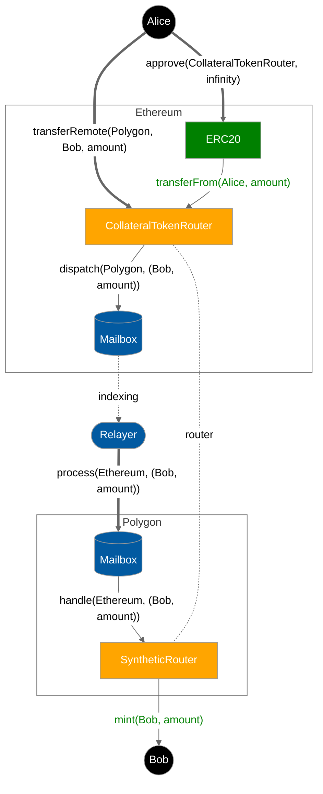
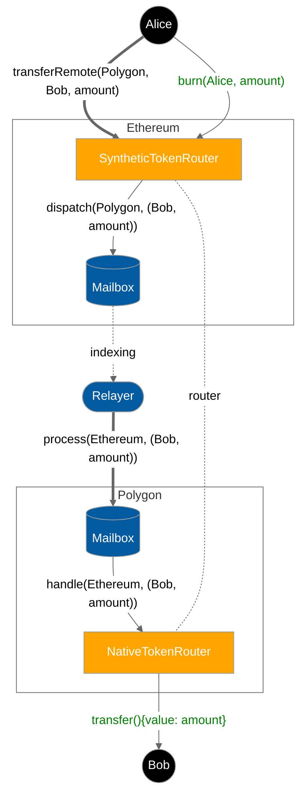

# Aetherium Tokens and Warp Routes

This repo contains contracts and SDK tooling for Aetherium-connected ERC20 and ERC721 tokens. The contracts herein can be used to create [Aetherium Warp Routes](https://docs.aetherium-nexus.com/docs/reference/applications/warp-routes) across different chains.

For instructions on deploying Warp Routes, see [the deployment documentation](https://docs.aetherium-nexus.com/docs/deploy-aetherium#deploy-a-warp-route) and the [Aetherium CLI](https://www.npmjs.com/package/@aetherium-nexus/cli).

## Warp Route Architecture

A Warp Route is a collection of [`TokenRouter`](./libs/TokenRouter.sol) contracts deployed across a set of Aetherium chains. These contracts leverage the `Router` pattern to implement access control and routing logic for remote token transfers. These contracts send and receive [`Messages`](./libs/TokenMessage.sol) which encode payloads containing a transfer `amount` and `recipient` address.



The Token Router contract comes in several flavors and a warp route can be composed of a combination of these flavors.

- [`Native`](./AetNative.sol) - for warping native assets (e.g. ETH) from the canonical chain
- [`Collateral`](./AetERC20Collateral.sol) - for warping tokens, ERC20 or ERC721, from the canonical chain
- [`Synthetic`](./AetERC20.sol) - for representing tokens, Native/ERC20 or ERC721, on a non-canonical chain

## Interchain Security Models

Warp routes are unique amongst token bridging solutions because they provide modular security. Because the `TokenRouter` implements the `IMessageRecipient` interface, it can be configured with a custom interchain security module. Please refer to the relevant guide to specifying interchain security modules on the [Messaging API receive docs](https://docs.aetherium-nexus.com/docs/reference/messaging/messaging-interface).

## Remote Transfer Lifecycle Diagrams

To initiate a remote transfer, users call the `TokenRouter.transferRemote` function with the `destination` chain ID, `recipient` address, and transfer `amount`.

```solidity
interface TokenRouter {
  function transferRemote(
    uint32 destination,
    bytes32 recipient,
    uint256 amount
  ) public returns (bytes32 messageId);
}
```

**NOTE:** The [Relayer](https://docs.aetherium-nexus.com/docs/operate/relayer/run-relayer) shown below must be compensated. Please refer to the details on [paying for interchain gas](https://docs.aetherium-nexus.com/docs/protocol/interchain-gas-payment).

Depending on the flavor of TokenRouter on the source and destination chain, this flow looks slightly different. The following diagrams illustrate these differences.

### Transfer Alice's `amount` native ETH from Ethereum to Bob on Polygon



### Transfer Alice's ERC20 `amount` from Ethereum to Bob on Polygon



### Transfer Alice's `amount` synthetic MATIC from Ethereum back to Bob as native MATIC on Polygon



**NOTE:** ERC721 collateral variants are assumed to [enumerable](https://docs.openzeppelin.com/contracts/4.x/api/token/erc721#IERC721Enumerable) and [metadata](https://docs.openzeppelin.com/contracts/4.x/api/token/erc721#IERC721Metadata) compliant.

## Versions

| Git Ref               | Release Date | Notes                       |
| --------------------- | ------------ | --------------------------- |
| [audit-remediation]() | 2025-04-15   | Aetherium Audit remediation |
| [main]()              | ~            | Bleeding edge               |

## Learn more

For more information, see the [Aetherium introduction documentation](https://docs.aetherium-nexus.com/docs/intro).
